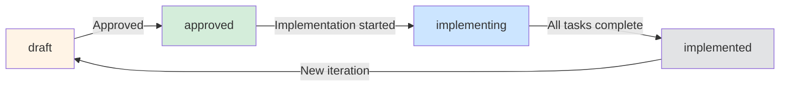

# Flow Commands

A comprehensive workflow system for managing Product Requirements Documents (PRDs), task generation, and implementation.

## Quick Start

```
1. Plan your feature    → /flow:plan       (Generate PRD from requirements)
2. Generate tasks       → /flow:generate-tasks  (Create implementation tasks)
3. Implement            → /flow:implement  (Execute tasks)
4. Cleanup              → /flow:cleanup    (Finalize and merge)
```

## PRD Status Flow



**ASCII fallback:**

```
┌─────────┐     approve     ┌──────────┐     start     ┌──────────────┐
│  draft  │ ──────────────> │ approved │ ────────────> │ implementing │
└─────────┘                 └──────────┘                └──────┬───────┘
                                                           │
                                              all tasks    │
                                              complete     │
                                                           ▼
                                                   ┌──────────────┐
                                                   │ implemented  │
                                                   └──────────────┘

Iteration: implemented ──(new changes)──> draft
```

**Status meanings:**

| Status | Icon | Description |
|--------|------|-------------|
| `draft` | 📝 | PRD being written, not yet approved |
| `approved` | ✅ | PRD approved, ready for task generation |
| `implementing` | 🔄 | Tasks in progress, implementation active |
| `implemented` | ✨ | Feature complete, all tasks closed |

## Quick Reference

| Command | Purpose | PRD Status Required | Output |
|---------|---------|---------------------|--------|
| `/flow:plan` | Create/update PRD | Any | PRD markdown file |
| `/flow:generate-tasks` | Generate tasks | `approved` | Epics + sub-tasks |
| `/flow:implement` | Execute tasks with skills | `approved` → `implementing` | Code + commits |
| `/flow:summary` | Show progress | Any | Status summary |
| `/flow:cleanup` | Finalize + generate docs | `implementing` | Merge + status update |

## Command Discovery

**I need to...**

| Goal | Command |
|------|---------|
| Start a new feature | `/flow:plan` |
| Break down work into tasks | `/flow:generate-tasks` |
| Start implementing | `/flow:implement` |
| Check what's left to do | `/flow:summary` |
| Finish up and merge | `/flow:cleanup` |
| Update an existing PRD | `/flow:plan` (auto-detects iteration) |

## Workflow Overview

### Phase 1: Planning (`/flow:plan`)

1. **Check prerequisites** - git (required), beads (optional), worktrunk (optional)
2. **Create worktree** - Optional but recommended for isolation
3. **Clarifying questions** - 3-5 questions at a time to gather requirements
4. **Generate PRD** - Creates structured markdown with frontmatter
5. **Approval cycle** - Review and approve before task generation

**Output:** `/.flow/prd-[feature]-vN.md`

### Phase 2: Task Generation (`/flow:generate-tasks`)

1. **Auto-discover PRD** - Matches current git context (branch/worktree)
2. **Check existing tasks** - Detects if PRD was previously processed
3. **Context discovery** - Explore agents find relevant files
4. **Generate epics** - 5-7 high-level parent issues
5. **Generate sub-tasks** - Detailed tasks with dependencies
6. **Priority assignment** - P0-P4 based on PRD requirements

**Output:** Beads issues (or TodoWrite fallback)

### Phase 3: Implementation (`/flow:implement`)

1. **Discover PRD** - Auto-detected from git context
2. **Validate status** - Must be `approved` or `implementing`
3. **Execute tasks** - Autonomous with specialized subagents
4. **Parallel execution** - Groups marked [P:Group-X] run concurrently
5. **Progress tracking** - Updates task status as work completes
6. **Context refresh** - `/flow:summary` every 5 tasks or 30 minutes

**Output:** Implemented features + commits

### Phase 4: Cleanup (`/flow:cleanup`)

1. **Verify completion** - All tasks must be closed
2. **Worktree merge** - Optional (if in worktree)
3. **Summary commit** - Groups all implementation changes
4. **Update PRD** - Status → `implemented`, add changelog entry

**Output:** Merged code + updated PRD

## Architecture

The flow system is organized into modular components:

```
flow/
├── README.md (this file)
├── plan.md              # PRD generation workflow
├── generate-tasks.md    # Task generation from PRD
├── implement.md         # Task execution workflow
├── cleanup.md           # Post-implementation cleanup
├── summary.md           # Progress display
└── shared/
    ├── protocols/       # Reusable protocols
    │   ├── prd-discovery.md
    │   ├── auto-compaction-detection.md
    │   └── prd-change-management.md
    ├── templates/       # Common UI patterns
    │   ├── ask-user-questions.md
    │   └── beads-warning.md
    └── examples/        # Session transcripts
        ├── session-cleanup.md
        ├── session-implement.md
        └── testing-strategies.md
```

## Optional Tools

### Beads (bd)

Beads provides persistent task tracking with dependency awareness.

**Installation:**
```bash
curl -fsSL https://raw.githubusercontent.com/steveyeggie/beads/main/scripts/install.sh | bash
```

**Benefits:**
- Persistent task storage across sessions
- Dependency tracking between tasks
- Better visibility into progress and blockers
- Integration with PRD frontmatter

**Fallback:** If beads is not installed, the system uses TodoWrite (built-in tool).

### Worktrunk (wt)

Worktrunk simplifies git worktree management.

**Installation:**
```bash
brew install max-sixty/worktrunk/wt
# or
cargo install worktrunk
```

**Benefits:**
- Easy worktree creation and switching
- Automatic Claude Code launching in new worktrees
- Clean worktree removal

**Fallback:** Native git worktree commands work fine.

## Agent Skills

Agent Skills provide domain-specific guidance and capabilities that enhance the workflow with specialized expertise.

### Available Skills

| Skill | Purpose | Use When |
|-------|---------|----------|
| `frontend-design` | Creates distinctive, production-grade frontend UIs | Building web components, pages, or applications |
| `mcp-builder` | Builds custom MCP servers for external API integrations | Integrating with third-party APIs or services |
| `skill-creator` | Creates new agent skills with custom workflows | Defining domain-specific agent capabilities |
| `webapp-testing` | Tests web applications with Playwright | Verifying frontend functionality and UI behavior |
| `document-skills` | Generates professional documents (PDF, Word, PowerPoint, Excel) | Creating API docs, user guides, or technical specs |

### How Skills Work

**Skill Invocation Flow:**

```
Task with applicable_skills
    ↓
Check task metadata for skills
    ↓
Invoke Skill tool with context
    ↓
Skill provides domain-specific guidance
    ↓
Subagent executes with skill context
```

**Example: Frontend Task with Skills**

```python
# Task: Create login component
# Skills: frontend-design, webapp-testing

1. Skill invoked: frontend-design
   Output: Design guidelines for login form

2. Subagent: frontend-developer
   Executes: Implements login component following design

3. Skill invoked: webapp-testing
   Output: Playwright tests for login flow
```

### Skill Integration Points

**During Planning (`/flow:plan`):**
- Detects external API integrations
- Offers to create MCP servers using `mcp-builder`
- Stores skill requirements in PRD frontmatter

**During Task Generation (`/flow:generate-tasks`):**
- Analyzes task descriptions for skill triggers
- Assigns `applicable_skills` to task metadata
- Maps skills to subagent types

**During Implementation (`/flow:implement`):**
- Invokes skills before subagent execution
- Passes skill output as context to subagents
- Applies skill-specific patterns and best practices

**During Cleanup (`/flow:cleanup`):**
- Offers documentation generation with `document-skills`
- Creates API docs, user guides, or technical specs
- Commits generated documentation

### Skill Assignment Examples

| Task Type | Category | Skills Assigned |
|-----------|----------|-----------------|
| "Create responsive UI for dashboard" | frontend | `frontend-design`, `webapp-testing` |
| "Build MCP server for GitHub integration" | backend | `mcp-builder` |
| "Generate API documentation from endpoints" | documentation | `document-skills` |
| "Add E2E tests for checkout flow" | testing | `webapp-testing` |
| "Create custom skill for code review" | ai | `skill-creator` |

### Configuration

Skills are configured in `.claude/subagent-types.yaml`:

```yaml
skill_mappings:
  frontend-design:
    triggers:
      - "create.*ui"
      - "build.*interface"
      - "design.*component"
    prompt_template: |
      Create distinctive, production-grade frontend UI for: {task_description}

skill_execution_config:
  modes:
    auto:
      enabled: true
      require_metadata: true
    conditional:
      enabled: true
      use_trigger_patterns: true
```

### Benefits

- **Domain Expertise:** Skills provide specialized knowledge for specific task types
- **Consistency:** Automated skill application ensures quality standards
- **Efficiency:** Skills guide subagents with proven patterns
- **Flexibility:** Multiple skills can be combined for complex tasks
- **Quality Assurance:** Skills like webapp-testing add verification layers

## Advanced Topics

### PRD Iteration

When updating an approved PRD:
- Status resets to `draft`
- Version increments (vN → vN+1)
- Existing tasks are archived
- New tasks generated from updated requirements

See `shared/protocols/prd-change-management.md` for details.

### Auto-Compaction Detection

Claude Code compacts long conversations. The system includes:
- Automatic detection of stale context
- Timestamp-based refresh triggers
- `/flow:summary` integration for context restoration

See `shared/protocols/auto-compaction-detection.md` for details.

### Parallel Task Execution

Tasks marked with `[P:Group-X]` execute concurrently via specialized subagents:
- Frontend tasks → `frontend-developer`
- Backend tasks → `backend-architect`
- Database tasks → `database-admin`
- Testing tasks → `test-automator`

See `shared/examples/session-implement.md` for examples.

## Getting Help

Each command file includes:
- Quick-start header (5 lines)
- Detailed process documentation
- References to shared protocols
- Example sessions in `shared/examples/`

For specific workflow details, see the individual command files or the shared protocols directory.
